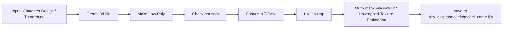

# Create 3d model

```mermaid
flowchart LR
    A["Input: Character Design / Turnaround"] --> Z["Create 3d file"]
    Z --> B["Make Low-Poly"]
    B --> W["Check normals"]
    W --> C["Ensure in T-Pose"]
    C --> D["UV Unwrap"]
    D --> E["Output: fbx File with UV Unwrapped Texture Embedded"]
    E --> F["save to raw_assets/models/model_name.fbx"]

```
