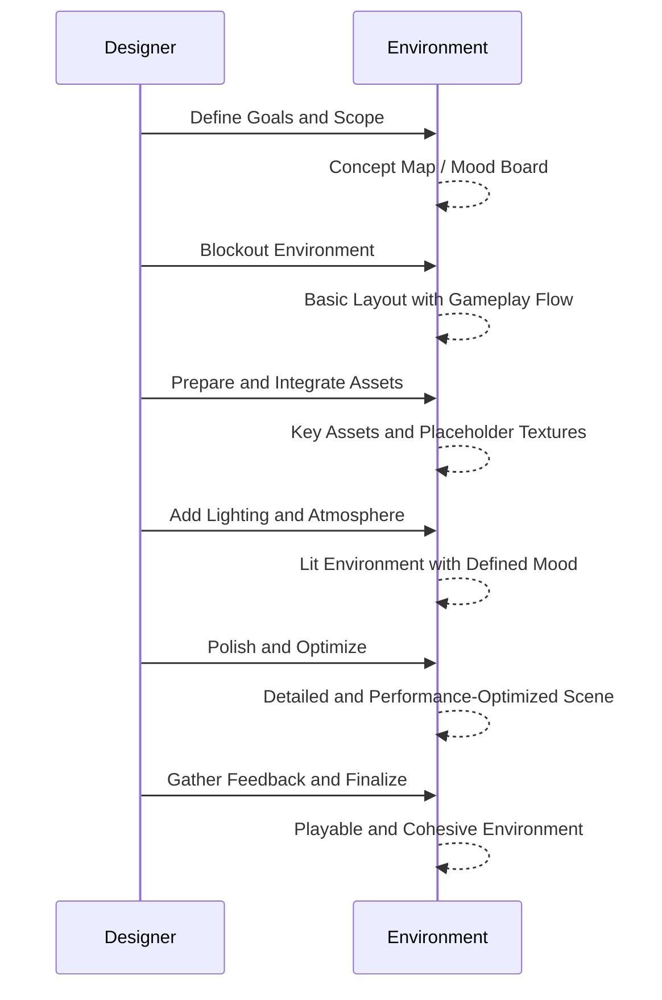

# Level Blockout process

```mermaid
sequenceDiagram
    participant Designer
    participant Environment

    Designer->>Environment: Define Goals and Scope
    Environment-->>Environment: Concept Map / Mood Board

    Designer->>Environment: Blockout Environment
    Environment-->>Environment: Basic Layout with Gameplay Flow

    Designer->>Environment: Prepare and Integrate Assets
    Environment-->>Environment: Key Assets and Placeholder Textures

    Designer->>Environment: Add Lighting and Atmosphere
    Environment-->>Environment: Lit Environment with Defined Mood

    Designer->>Environment: Polish and Optimize
    Environment-->>Environment: Detailed and Performance-Optimized Scene

    Designer->>Environment: Gather Feedback and Finalize
    Environment-->>Environment: Playable and Cohesive Environment
```